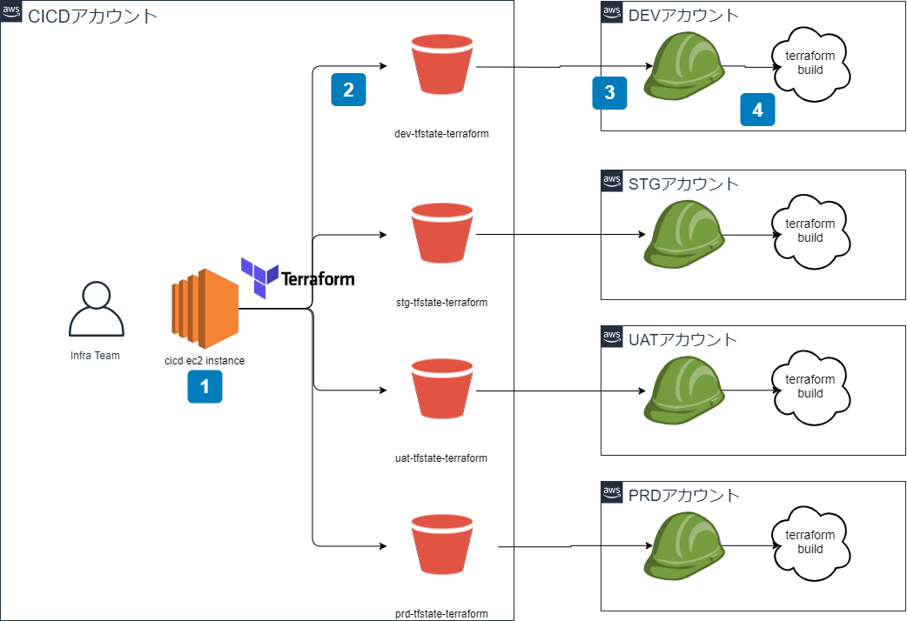

# README

## 設計方針

- 機能単位で第一階層にディレクトリを切る
- 構成要素単位で第二階層にディレクトリを切る
- 環境を格納するディレクトリを第二階層に切る
- main.tf に module 定義、provider, terraform ステートバケット定義を記載する
- variables.tf に　各環境ごとで異なる値を記載する

## ステートファイルについて

- 機能別環境単位にステートファイルを作成する
- ステートファイルは CI/CD アカウントに S3 を作成し、複数ユーザで共有する

## 環境ごとの切り替えについて

- CI/CD アカウントからクロスアカウントの仕組みを用いて各環境に terraform を適用する
- AWS CLI config に環境ごとの profile 設定を記載する
- main.tf provider 定義に環境ごとで利用する profile を記載する

## Terraform 適用方式



- DEV アカウントに terraform を適用する際のフロー

1. CICD アカウントを設定した AWS CLI にログインし、`$ terraform build`を実行する
1. S3 バケット に tfstate が保管される
1. 対象環境にスイッチロール
1. クロスアカウントロールで DEV アカウントに指定されたリソースが作成される

## ディレクトリ構成

```tree
`-- terraform
    |-- <service1>                ... 機能単位でディレクトリを作成する
    |   |-- <resource1>           ... 機能を構成するresource名でディレクトリを作成する(S3/CloudFront/EC2/S3/ElastiCache/RDS etc)
    |   |   `-- <resource1>.tf    ... 機能を構成するtfファイルを定義する
    |   |-- <resource2>
    |   |   `-- <resource2>.tf
    |   |-- env
    |   |   |-- dev
    |   |   |   |-- main.tf      ... module定義、provider, terraformステートバケット定義を記載する
    |   |   |   `-- variables.tf ... 各環境ごとに異なる値を記載する
    |   |   |-- prd
    |   |   |   |-- main.tf
    |   |   |   `-- variables.tf
    |   |   `-- stg
    |   |       |-- main.tf
    |   |       `-- variables.tf
    |   |-- README.md            ... terraformの適用手順を記載する
    |-- <service2>
    |   |-- <resource3>
    |   |   `-- <resource3>.tf
    |   |-- <resource4>
    |   |   `-- <resource4>.tf
    |   |-- env
    |   |   |-- dev
    |   |   |   |-- main.tf
    |   |   |   `-- variables.tf
    |   |   |-- prd
    |   |   |   |-- main.tf
    |   |   |   `-- variables.tf
    |   |   `-- stg
    |   |       |-- main.tf
    |   |       `-- variables.tf
    |   `-- README.md
    `-- README.md
```

